= OpenX Assets

This repository provides a development environment and a curated collection of simulation assets aligned with the ASAM OpenX standards:
link:https://www.asam.net/standards/detail/opendrive/[OpenDrive],
link:https://www.asam.net/standards/detail/openscenario-xml/[OpenScenario XML],
link:https://www.asam.net/standards/detail/openmaterial/[OpenMaterial3D], and
link:https://www.asam.net/standards/detail/osi/[OpenSimulationInterface].

The simulation assets are originally designed for use with link:https://esmini.github.io/[esmini], a lightweight and modular OpenSCENARIO XML simulator, suitable for rapid prototyping, testing, and integration workflows. Future releases will target conformance with the link:https://www.asam.net/standards/detail/openmaterial/[OpenMATERIAL 3D] specification, while maintaining compatibility with the OpenSceneGraph (OSG) formats for Esmini support.

If you find this project valuable, please consider *sponsoring our open-source work*. We especially encourage *commercial users* to show their support if they benefit from these assets.

Visit link:https://github.com/sponsors/bounverif[our GitHub Sponsors page] to learn more.

== What's Included in Releases

The latest release is available under link:https://github.com/bounverif/openx-assets/releases[Releases] and currently includes:

- Low- and medium-polygon 3D vehicle assets with preliminary link:https://www.asam.net/standards/detail/openmaterial/[OpenMATERIAL 3D] compliance
- link:https://www.asam.net/standards/detail/openscenario-xml/[OpenSCENARIO XML] vehicle catalogs and link:https://www.asam.net/standards/detail/openmaterial/[OpenMATERIAL 3D] asset files based on real-world vehicle models, annotated with:
  * ✔️ Bounding box dimensions
  * ✔️ Mass properties
  * ⏳ Kinematic parameters (work in progress — contributions welcome)

== 3D Vehicle Gallery

[cols="1a,1a,1a,1a", frame=none, grid=none, stripes=none]
:figure-caption!:
|===

| 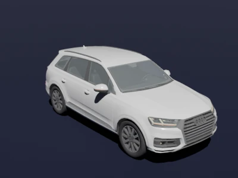
| 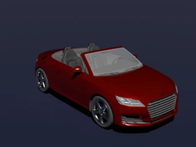
| 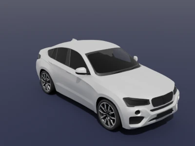
| 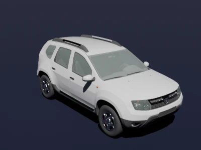

| 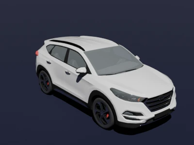
| 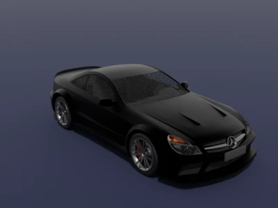
| 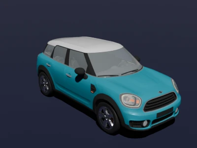
| 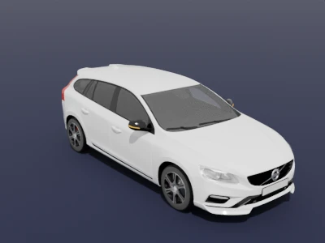

| 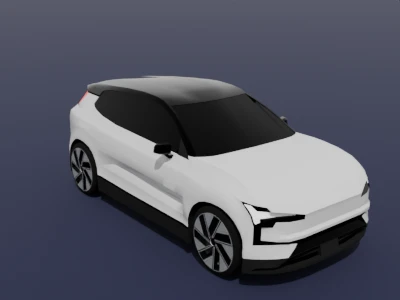
| 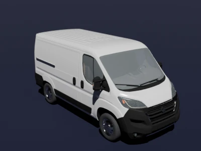
| 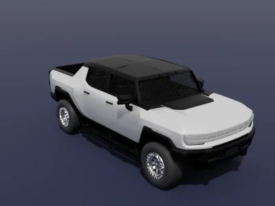
| 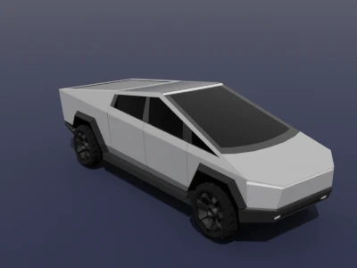

|===

== Blender Extension Package for Asset Development

This repository includes a basic Blender extension package designed to streamline the creation and validation of simulation assets compliant with ASAM OpenX standards.

To install the extension on a typical Linux environment, create a symbolic link to the Python package within Blender’s default user extensions repository (named `user_default`) as follows:

[source, bash]
----
ln -s ${PWD}/python/openx_assets ${BLENDER_USER_RESOURCES}/extensions/user_default/
----

Here, `BLENDER_USER_RESOURCES` typically points to the Blender configuration directory, usually located at `$HOME/.config/blender` on Linux. This location may change depending on your Blender distribution source. Please follow Blender guides for installing the extension for other environments.

== GLTF Format

GLTF is the primary interchange format used in this repository for 3D assets due to its efficiency, interoperability, and extensibility. It supports:

- Compact, runtime-optimized binary encoding (`.glb`) for deployment
- Human-readable JSON-based structure (`.gltf`) for inspection and easy tooling
- Native integration with modern rendering engines and web-based visualizers

GLTF is the preferred format for all assets in this repository and serves as the reference format for standards compliance, quality assurance, and downstream integration workflows.

== FBX and OSG Formats

While GLTF is the preferred format, the repository also maintains compatibility with:

- *FBX*: Supported primarily for compatibility with other simulation and asset conversion workflows.
- *OSGB*: Native format for the Esmini simulator. Assets exported in `.osgb` format from the FBX assets can be used directly in Esmini simulation runtime.

Support for these formats ensures backward compatibility and smooth transition paths from existing asset libraries to OpenX-compliant environments.

NOTE: Due to licensing restrictions, we cannot distribute the Autodesk FBX SDK, which is needed to convert `.fbx` models into `.osgb`. However, you can install the plugin inside the devcontainer using the script at `/usr/local/bin/fbxsdk-install.sh`.

== License Information

All contents of this repository—including source code, simulation assets, and associated tools—are distributed under the link:https://opensource.org/licenses/MPL-2.0[Mozilla Public License 2.0 (MPL-2.0)], unless otherwise noted. Portions of the 3D assets are derived from original works licensed under the link:https://creativecommons.org/licenses/by/4.0/[Creative Commons Attribution 4.0 International (CC BY 4.0)] license.

The OpenX Assets Blender extension package is distributed under the link:https://opensource.org/licenses/GPL-3.0[GNU General Public License v3.0 (GPL-3.0)] or later.

This project complies with the link:https://reuse.software/spec-3.3/[REUSE Specification 3.3].
